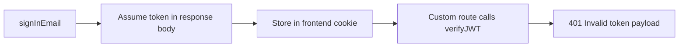
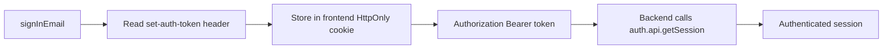

# Canonical Better Auth Bearer Frontend Pattern

This is the canonical pattern for using `auth-engine-x-api` from separate frontend
apps that do **not** share browser cookies with the auth domain.

This document exists because we already burned time on a subtle but important
contract bug: the frontend and backend were both "doing auth," but they were
doing **different kinds** of auth.

Use this as the source of truth when wiring future frontend apps.

## Executive Summary

If a frontend app lives on a different domain from `auth-engine-x-api`, the
correct pattern is:

1. Frontend server route calls `POST /api/auth/sign-in/email`
2. Read the Better Auth **session bearer token** from the `set-auth-token` response header
3. Store that token in a frontend-owned HttpOnly cookie on the frontend domain
4. For protected routes and authenticated server-side API calls, send:
   `Authorization: Bearer <that-session-token>`
5. Backend validates that token using Better Auth session handling via
   `auth.api.getSession(...)`

That is the whole game.

## What Broke

The original failure looked like this:

- Sign-in succeeded
- Frontend cookie write succeeded
- `GET /api/auth/token/session` returned `401`
- Upstream message was `Invalid token payload`

That error was real, but misleading unless you know the contract mismatch.

### Actual root cause

We mixed two different Better Auth token models:

- **Bearer session token**
  - comes from the `set-auth-token` response header
  - is meant to be used with Better Auth session resolution
  - should be validated with `auth.api.getSession(...)`

- **JWT plugin token**
  - comes from `/api/auth/token` or `set-auth-jwt`
  - is a JWT for JWT-oriented integrations
  - should be validated as a JWT, not treated like the bearer session token

We were doing this broken flow:



But Better Auth wanted this:



## The Canonical Contract

### Sign-in artifact

The auth artifact for cross-domain frontend apps is:

- **The Better Auth bearer session token**
- retrieved from: `set-auth-token`
- not from: `data.token`
- not from: `set-auth-jwt`

### Validation mechanism

That bearer session token must be validated through:

- `auth.api.getSession({ headers })`

It should **not** be validated through:

- `auth.api.verifyJWT(...)`

unless you have intentionally chosen a JWT-based auth contract and designed the
entire system around that.

## What Is Correct

### Backend

In `auth-engine-x-api`, the backend should:

1. Enable Better Auth `bearer()`
2. Accept `Authorization: Bearer <session-token>`
3. Resolve the session with `auth.api.getSession(...)`
4. Shape the response into whatever frontend-friendly JSON you want

### Frontend

A frontend app should:

1. Proxy sign-in through a server-side route
2. Read `set-auth-token` from the auth-engine response
3. Set an app-domain HttpOnly cookie, for example `pe_session`
4. Read that cookie server-side for middleware and server routes
5. Forward it as `Authorization: Bearer <cookie-value>`

## What Is Not Correct

These are anti-patterns.

### 1. Do not read `data.token` from sign-in and assume that is the frontend auth token

That was the core bug.

If you are calling Better Auth sign-in and then storing a token from the JSON
body, you are probably doing the wrong thing for this cross-domain bearer flow.

### 2. Do not treat Better Auth bearer session tokens and JWT plugin tokens as interchangeable

They are not interchangeable.

If you choose bearer session auth, stay on bearer session auth end-to-end.

If you choose JWT auth, then commit to JWT auth end-to-end and define that
contract intentionally.

Do not mix them.

### 3. Do not validate the frontend cookie token with `verifyJWT(...)` unless the cookie explicitly contains a JWT

In this pattern, the cookie should contain the bearer session token from
`set-auth-token`, and the backend should validate it with `getSession(...)`.

### 4. Do not rely on browser cookie sharing across domains

This whole pattern exists to avoid cross-domain cookie dependency.

The frontend app should own its own auth cookie.

### 5. Do not store the auth token in `localStorage`

Use an app-domain HttpOnly cookie.

## Canonical Backend Implementation

### Required Better Auth plugins

`src/auth.ts`

```ts
import { bearer, organization, jwt } from "better-auth/plugins";

plugins: [
  organization(),
  bearer(),
  jwt(...),
]
```

Why `bearer()` matters:

- it tells Better Auth to support bearer-session handling correctly
- without it, sending `Authorization: Bearer ...` and expecting session
  semantics is the wrong contract

### Canonical session resolution

`src/index.ts`

```ts
const authSession = await auth.api.getSession({
  headers: new Headers(c.req.raw.headers),
});
```

This is the important part.

The backend should ask Better Auth, "given these headers, what session is this?"

That is the stable contract.

### Thin compatibility endpoint

Keep `GET /api/auth/token/session` if you want a frontend-friendly endpoint.
That route should be a thin adapter over `getSession(...)`, not a second auth
system.

Good:

```ts
app.get("/api/auth/token/session", async (c) => {
  const session = await auth.api.getSession({
    headers: new Headers(c.req.raw.headers),
  });
  // shape response
});
```

Bad:

```ts
app.get("/api/auth/token/session", async (c) => {
  const verifyResult = await auth.api.verifyJWT({ body: { token } });
  // invent JWT semantics for a bearer session flow
});
```

## Canonical Frontend Implementation

### 1. Sign-in proxy route

The frontend server route should:

- forward the sign-in request to `auth-engine-x-api`
- read `set-auth-token`
- set an app-domain HttpOnly cookie

Example shape:

```ts
const signInRes = await fetch(`${AUTH_URL}/api/auth/sign-in/email`, {
  method: "POST",
  headers: {
    "content-type": "application/json",
    origin,
    "x-forwarded-host": forwardedHost,
    "x-forwarded-proto": forwardedProto,
  },
  body,
});

const token = signInRes.headers.get("set-auth-token");
```

If `token` is missing, treat sign-in as failed for this flow.

### 2. App-domain auth cookie

Set a cookie like:

```ts
cookies().set("pe_session", token, {
  httpOnly: true,
  secure: process.env.NODE_ENV === "production",
  sameSite: "lax",
  path: "/",
  maxAge: 60 * 60 * 24 * 7,
});
```

The name can vary by app. The important part is that:

- it is HttpOnly
- it lives on the frontend domain
- it stores the bearer session token from `set-auth-token`

### 3. Session-check route

Every frontend app should have a small diagnostic route that:

- reads the frontend auth cookie
- calls `/api/auth/token/session`
- returns structured debug output

This is useful because it separates:

- "cookie is missing"
- "cookie exists but upstream rejected it"
- "network or fetch failure"

### 4. Middleware

Middleware should:

1. read the app-domain cookie
2. call the auth engine with `Authorization: Bearer <cookie>`
3. redirect to login and clear the cookie on `401`

Do not make middleware do anything more clever than that.

## Production Gotchas

### Gotcha 1: A successful sign-in response does not prove the right token was stored

You must distinguish:

- sign-in success
- cookie persistence success
- session validation success

These are three different proof steps.

### Gotcha 2: If `/api/auth/token/session` fails, that does not mean cookies are broken

If the frontend can read `pe_session` back through its own server route, cookie
storage is probably fine.

The next suspect is the token contract, not the cookie layer.

### Gotcha 3: `BETTER_AUTH_URL` and `NEXT_PUBLIC_AUTH_URL` must match the actual public auth host

For this setup, the correct values were:

- backend `BETTER_AUTH_URL = https://api.authengine.dev`
- frontend `NEXT_PUBLIC_AUTH_URL = https://api.authengine.dev`

If those drift, you will chase ghosts.

### Gotcha 4: `ALLOWED_ORIGINS` matters for browser-facing bearer routes

For this setup:

- backend `ALLOWED_ORIGINS = https://app.paidedge.dev`

If this is wrong, you can get frontend failures that look auth-adjacent but are
actually cross-origin policy failures.

### Gotcha 5: Build markers are worth it

A tiny visible build marker on the login page saved time.

If you are debugging deploy-sensitive auth behavior, stamp the login page with a
temporary marker so you can confirm the live frontend is actually on the code
you think it is.

## What We Changed In This Incident

### Backend

Files:

- `src/auth.ts`
- `src/index.ts`

Changes:

- enabled `bearer()`
- replaced custom `verifyJWT(...)` bearer validation with `auth.api.getSession(...)`
- kept `/api/auth/token/session` as a frontend-friendly adapter
- kept `/api/auth/organization/list` on the same session resolution logic

### Frontend

Files:

- `paid-edge-frontend-app/src/app/api/auth/sign-in/route.ts`
- `paid-edge-frontend-app/src/app/(auth)/login/page.tsx`

Changes:

- read `set-auth-token` instead of assuming `data.token`
- stored that token into `pe_session`
- updated the login build marker for live verification

### Documentation

File:

- `PAIDEDGE_FRONTEND_BEARER_AUTH_DIRECTIVE.md`

Changes:

- rewrote the auth artifact description to match the real contract

## How To Replicate This In Another Frontend App

For every new frontend app:

1. Create a server-side sign-in proxy route
2. Forward sign-in to `https://api.authengine.dev/api/auth/sign-in/email`
3. Read `set-auth-token`
4. Store it in an app-owned HttpOnly cookie
5. Add a tiny `/api/auth/token` route that reads that cookie back
6. Add a `/api/auth/session-check` route for structured diagnostics
7. Have middleware validate with:
   - `GET https://api.authengine.dev/api/auth/token/session`
   - `Authorization: Bearer <cookie-value>`
8. Clear the cookie and redirect on `401`

If you do those eight things and keep the backend on `getSession(...)`, you are
on the right path.

## Fast Diagnostic Checklist

When a new frontend app fails to sign in, check these in order:

1. Does sign-in return `set-auth-token`?
2. Is that exact value stored in the frontend cookie?
3. Can the frontend server read that cookie back?
4. Does `GET /api/auth/token/session` succeed with that exact value?
5. Do `BETTER_AUTH_URL` and `NEXT_PUBLIC_AUTH_URL` match?
6. Does backend `ALLOWED_ORIGINS` include the frontend origin?
7. Is the live frontend actually on the expected build?

If you skip that order, you waste time.

## Opinionated Rules

These are the rules.

- Use bearer session tokens for cross-domain frontend apps unless you have a very
  strong reason not to.
- Do not invent a half-bearer, half-JWT hybrid.
- Do not validate frontend bearer tokens with JWT verification by default.
- Do not guess which token Better Auth wants. Prove it from the response header.
- Do not trust a deploy until the live app shows the expected build marker or
  behavior.

## Source Files

Primary backend files:

- `src/auth.ts`
- `src/index.ts`

Primary frontend files in `paid-edge-frontend-app`:

- `src/app/api/auth/sign-in/route.ts`
- `src/app/api/auth/token/route.ts`
- `src/app/api/auth/session-check/route.ts`
- `src/middleware.ts`
- `src/app/(auth)/login/page.tsx`

Primary reference docs:

- `docs/api-refs/better-auth/docs/content/docs/plugins/bearer.mdx`
- `docs/api-refs/better-auth/docs/content/docs/plugins/jwt.mdx`

## Bottom Line

The correct auth artifact for these frontend apps is the Better Auth bearer
session token from `set-auth-token`.

The correct backend validator for that artifact is `auth.api.getSession(...)`.

Everything else is how you end up staring at `Invalid token payload` while the
wrong layer gets blamed.
